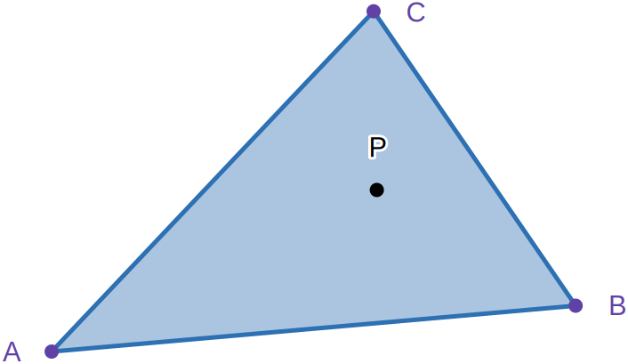
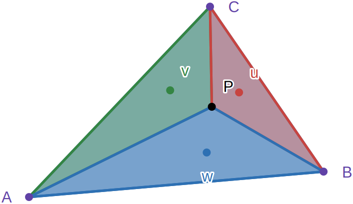

### The Situation

Given 3 points that form a triangle in 3-dimensional space and a ray pointing from an origin into a direction we need to know if the ray intersects the inside of the triangle at any point in space.

### Definitions

##### Known

$A$ is the position of one corner of the triangle

$B$ is the position of one other corner of the triangle

$C$ is the position of the other corner of the triangle

$O$ is the origin of the ray

$\vec D$ is the normalised direction of the ray

##### Unknown

$d$ is the distance at which the ray intersects the triangle

$\vec N$ is the normal vector of the triangle (not normalised)

$P$ is the point where the ray intersects the plane the triangle lies on

### The Idea

Calculate the plane that the triangle lies on and find the point $P$ where the ray intersects the plane. Then find out whether $P$ is inside the triangle.

This is our setup.

We know that $P$ must lie on the trajectory of the ray. Therefore:

$$
P = O + \vec D d
$$

This can be imagined as starting at the origin $O$ and moving the distance $d$ into the direction $\vec D$.

Since this polygon has 3 vertices $A$, $B$ and $C$ it lies on a single plane.
Point $P$ also has to lie on this plane to be inside the triangle.
The dot product of two perpendicular vectors always results in 0. The normal of the triangle $\vec N$ is also the normal of the plane. It is perpendicular to any vector that follows the surface of the plane. We already know the values of 3 points that lie on the plane so we can easily construct a vector that follows it. But we want to find $P$, so we'll keep this in terms of it.
We want $P$ to be the point where the ray hits the plane, so we know that it's on its surface. For the other point on the plane you could use any of the 3 verices we know but I'll use $A$.

$$
\begin{aligned}
\vec N \cdot \vec{AP} &= 0 \\
\vec N \cdot (A - P) &= 0 \\
\end{aligned}
$$

You could also use $P - A$ since both are perpendicular to $\vec N$.

Now that we have another equation that has $P$ in it we can substitute it for the expression from thefirst equation.

$$
\begin{aligned}
\vec N \cdot (A - O + \vec D d) &= 0 \\
\vec N \cdot A - \vec N \cdot O + \vec N \cdot \vec D d &= 0
\end{aligned}
$$

Our goal is to find $P$ and since we already know $O$ and $\vec D$ we only need d to calculate it with the first equation. So we'll solve this equation for d:

$$
\begin{aligned}
\vec N \cdot A - \vec N \cdot O &= - \vec N \cdot \vec D d \\
\vec N \cdot A - \vec N \cdot O &= (- \vec N \cdot \vec D) d \\
\frac{\vec N \cdot A - \vec N \cdot O}{- \vec N \cdot \vec D} &=  d \\
- \frac{\vec N \cdot (A - O)}{\vec N \cdot \vec D} &=  d \\
\end{aligned}
$$

With that we can calculate $P$. The whole formula for it would be:

$$
\begin{aligned}
P &= O + \vec D (- \frac{\vec N \cdot (A - O)}{\vec N \cdot \vec D}) \\
P &= O - \vec D (\frac{\vec N \cdot (A - O)}{\vec N \cdot \vec D}) \\
\end{aligned}
$$

Now that we've been able to calculate $P$, we just need to check whether it's inside the triangle or not. I'm going to go over two approaches to this with the latter being a bit more abstract but overall faster to compute.

#### Approach 1: Cross Product

The cross product of two vectors has an interesting property

#### Approach 2: Baycentric Coordinates

