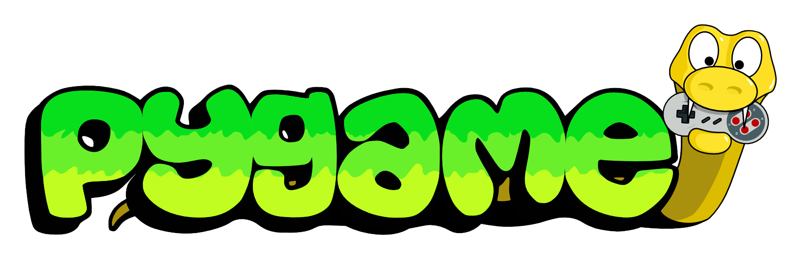
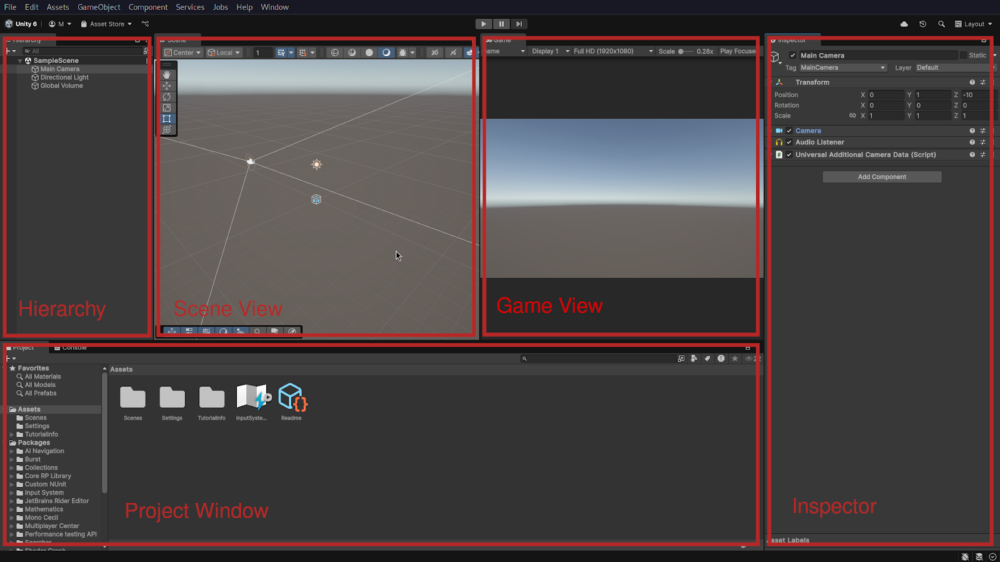
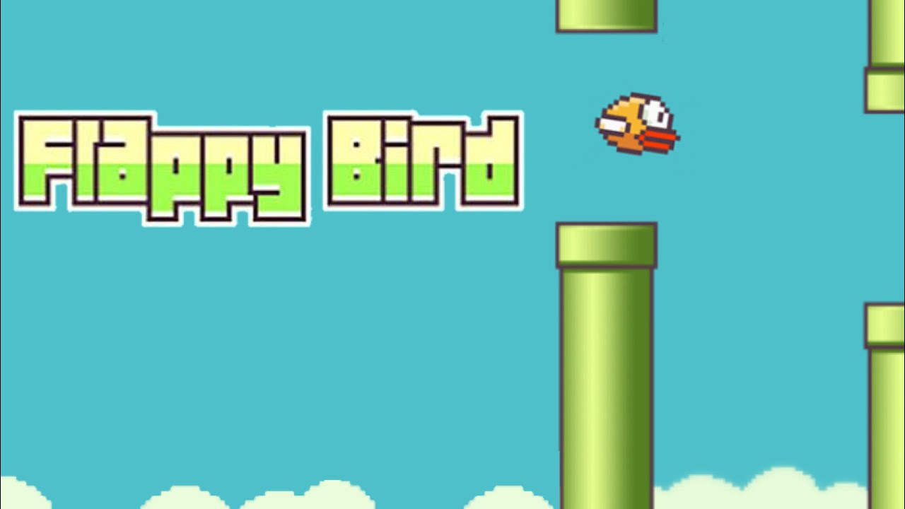
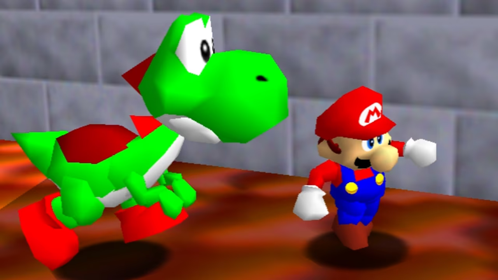
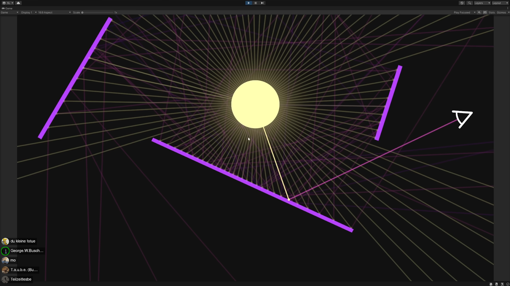
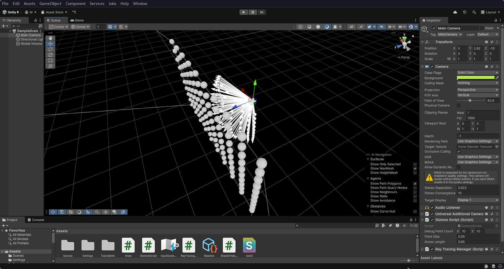
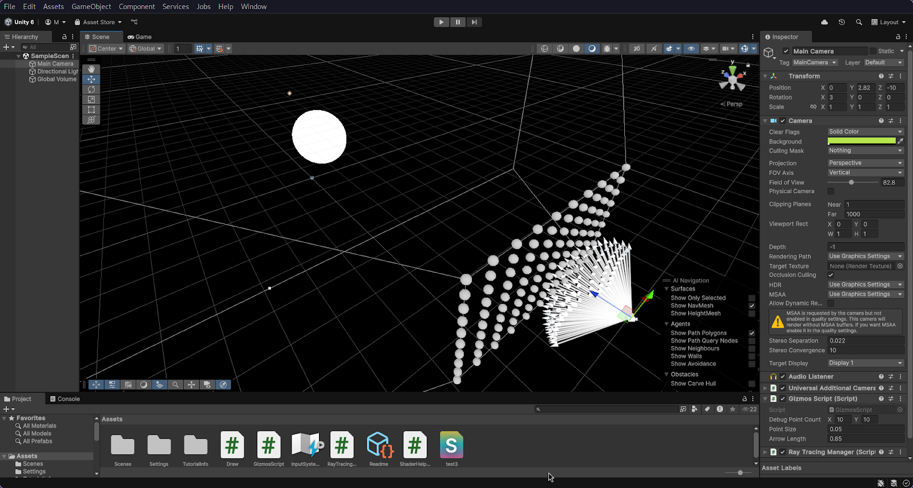
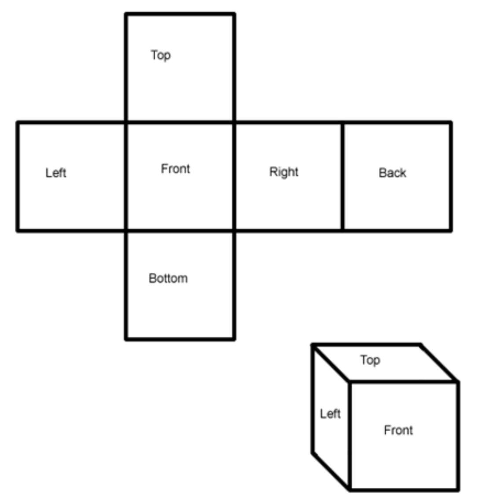
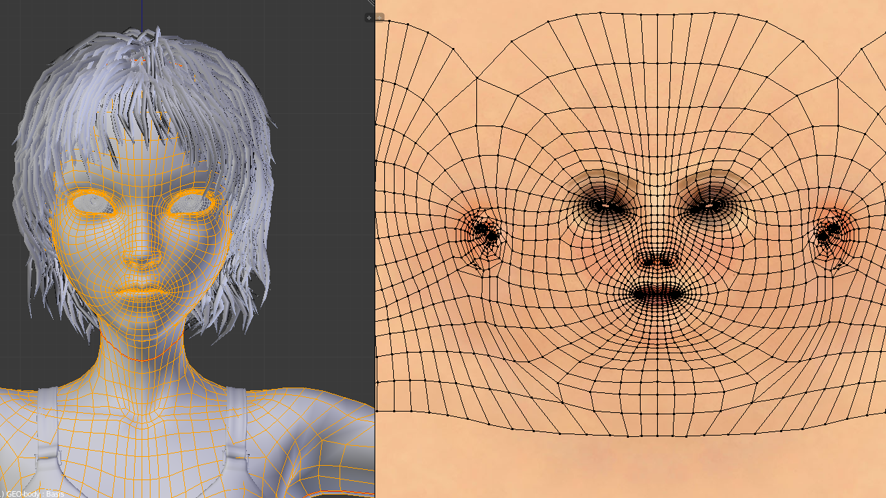

# Game Design

Wie aufwändig ist es, ein Videospiel zu entwickeln?

https://youtu.be/LcMTYhxAvJc?si=peT8SkNDbUcKWLmS

## Inhaltsverzeichnis

1. [Einleitung](#einleitung)

2. [Der Plan](#der-plan)

3. [Game Engines](#game-engines)

    3.1 [Pygame](#pygame)
   
    3.2 [Unity](#unity)
   
    3.3 [Unreal Engine](#unreal-engine)
   
    3.4 [Godot](#godot)
   
    3.5 [Unsere Entscheidung](#unsere-entscheidung)

4. [Lernplan](#lernplan)

5. [Unity im Detail](#unity-im-detail)

6. [Flappy Bird](#flappy-bird)

7. [Game Development Theorie](#game-development-theorie)

   7.1 [Graphics](#graphics)
   
   &nbsp;&nbsp;&nbsp;7.1.1 [Shader](#shader)
   
   &nbsp;&nbsp;&nbsp;7.1.2 [Assets](#assets)
   
   &nbsp;&nbsp;&nbsp;7.1.3 [2D](#2d)

   &nbsp;&nbsp;&nbsp;&nbsp;&nbsp;&nbsp;7.1.3.1 [Sprites](#sprites)

   &nbsp;&nbsp;&nbsp;&nbsp;&nbsp;&nbsp;7.1.3.2 [Layers](#layers)
   
   &nbsp;&nbsp;&nbsp;7.1.4 [3D](#3d)

   &nbsp;&nbsp;&nbsp;&nbsp;&nbsp;&nbsp;7.1.4.1 [3D Modelle](#3d-modelle)

   &nbsp;&nbsp;&nbsp;&nbsp;&nbsp;&nbsp;7.1.4.2 [Lighting](#lighting)

   &nbsp;&nbsp;&nbsp;&nbsp;&nbsp;&nbsp;&nbsp;&nbsp;&nbsp;7.1.4.2.1 [Raytracing](#raytracing)

   &nbsp;&nbsp;&nbsp;&nbsp;&nbsp;&nbsp;&nbsp;&nbsp;&nbsp;7.1.4.2.2 [Phong- und Blinn-Phong-Modell](#phong--und-blinn-phong-modell)

   &nbsp;&nbsp;&nbsp;&nbsp;&nbsp;&nbsp;7.1.4.3 [3D Texturen](#3d-texturen)

   &nbsp;&nbsp;&nbsp;&nbsp;&nbsp;&nbsp;7.1.4.4 [Normal Maps](#normal-maps)

   &nbsp;&nbsp;&nbsp;7.1.5 [Anti Aliasing](#anti-aliasing)

   7.2 [Physics](#physics)

   &nbsp;&nbsp;&nbsp;7.2.1 [Positionen und Movement](#positionen-und-movement)

   &nbsp;&nbsp;&nbsp;7.2.2 [Collisions](#collisions)

9. [Fazit](#fazit)

10. [Quellen](#quellen)

    

## Einleitung

Wir wurden direkt am Anfang des Projektes vor eine Aufgabe gestellt: auf den Schulrechnern war keine Software installiert, mit welcher man ein Game programmieren könnte, also mussten wir erreichen, dass die nötigen Programme installiert werden. Was nach einiger Absprache mit dem Medienteam der Schule aber kein Problem war. In den Tagen, in denen wir noch nicht programmieren konnten, nutzten wir die Zeit, um uns schon mal einen Plan zu erstellen, wie wir fortfahren wollten. Als dann die Programme endlich installiert waren, kam das nächste Problem: Aufgrund eines Exams einer Referendarin, mussten wir für zwei Tage in einen anderen Raum, in dem uns unsere Programme wieder nicht zur Verfügung standen. Also arbeiteten wir schon mal an der Dokumentation unserer Arbeiten. Für den nächsten Tag, an dem wir die Programme nicht nutzen konnten, nahmen wir uns vor Laptops mitzunehmen, damit wir endlich programmieren konnten. So konnte es am 06. März endlich losgehen.

## Der Plan

Zunächst war der Plan, ein relativ einfaches 2D Game zu programmieren, um die Oberfläche der Engine (dazu später mehr) zu lernen. Danach wollten wir mit dem ersten richtigen Projekt starten. Uns kamen sofort zwei Ideen in den Kopf: Ein Super-Mario-Clone oder ein Kultklassiker der Arcade-Gaming-Geschichte, nämlich Space Invaders. Da die Geschichte des Gamings mit dieser Art von Spielen seinen Anfang fand, entschieden wir uns damit unser Projekt so richtig zu beginnen.

Zu anderen, sehr viel ambitionierteren, Ideen von uns zählten Spiele, die einen großen Fokus auf 3D Grafiken legten und Spiele, die auf realistischen Physik-Simulationen aufbauen.

Eine Idee war ein Game, in dem man auf einem zufällig generierten Planeten startet und  sich mit den dort vorhandenen Ressourcen hochzuarbeiten, um andere Planeten zu erreichen und zu erobern. Wir hatten uns sehr viele Gedanken zu den technischen Details der Umsetzung gemacht und geplant, so viel wie möglich automatisch generieren zu lassen. Also im Prinzip genau der gleiche Grundsatz wie das 2016 veröffentlichte No Man’s Sky. 

Aufgrund der begrenzten Zeit beließen wir es aber bei 2D Grafiken.

## Game Engines

Um mit dem Space-Invaders-Clone anzufangen, mussten wir uns für eine Game Engine entscheiden, da wir es uns nicht zur Aufgabe machen wollten alle grundlegenden Funktionen von Grund auf selber aufzubauen.

Zur Erklärung: Eine Game Engine ist ein Framework, also ein “Programmiergerüst”, das die Entwicklung eines Spiels vereinfachen soll und zur Steuerung des Spielverlaufs und der visuellen Darstellung dient. In den meisten Fällen sind in einer Engine bereits Plattformen integriert, um das Game in der Engine zu erstellen. Um unsere Vorhaben umzusetzen, kamen vier Engines für uns in Frage:

### Pygame

<https://github.com/pygame/pygame>

Pygame ist Open-Source und eine sogenannte library für die populäre Programmiersprache Python. Es ist also keine Software, sondern eine große Ansammlung von Code, die man sehr einfach nutzen kann, um einem einige Arbeit abzunehmen. Es gibt einem einen einfachen Zugriff auf audiovisuelle Darstellung und auf die Verarbeitung von Spielerausgaben. Letztendlich ist es jedoch sehr viel weniger umfangreicher als unsere anderen Optionen und ermöglicht es einem außerdem nur 2D-Spiele für den Desktop zu erstellen.

### Unity

Unity ist für Hobbyisten schon seit Jahren der Standard für Spieleentwicklung. Es stellt einem eine relativ einfach zu spzfsch verstehende Entwicklungsumgebung bereit und hat Support für eigentlich jedes Feature, was man sich vorstellen kann. Man kann mit Unity sowohl 3D als auch 2D Spiele für alle Plattformen aufbauen und programmiert Scripts mit der Programmiersprache C# von Microsoft. Da es Unity schon so lange gibt, ist die Dokumentation zu dessen Nutzung sehr ausführlich.

### Unreal Engine

Unreal Engine ist die Engine, die der Konzern Epic-Games, welcher besonders **_FÜR FORTNITE_** bekannt ist, für seine Spiele nutzt. Der Fokus der Engine liegt hauptsächlich auf spezifischer 3D Grafik und erleichtert einem dessen Entwicklung substantiell. Viele große Spiele, auch abseits von Epic-Games,wurden mit Unreal entwickelt und punkten mit realistischer Darstellung, haben aber auch oft hohe Leistungsanforderungen. Unreal hat seine eigene Programmiersprache, nämlich UnrealScript, und mit Unreal lassen sich Spiele für den Desktop, das Handy, die Konsole und sogar für VR veröffentlichen.

### Godot

<https://github.com/godotengine/godot>

Als letztes dachten wir an die Open-Source Option Godot. Godot ist noch vergleichbar neu und hat nicht so große Firmen wie Unity und Unreal im Rücken, entwickelt sich jedoch extrem schnell voran und wird mittlerweile selbst mit den beiden marktführenden Engines, Unity und Godot verglichen. Godot hat sehr ähnliche Features und einen ähnlichen Aufbau wie Unity und Unreal, hat sich jedoch für eine lange Zeit nur auf 2D fokussiert und hat deswegen keine ganz so umfangreiche 3D Unterstützung. Mit Godot kann man sowohl Desktop, als auch Mobile und mit etwas Arbeit auch Console Games erstellen. Um für Godot zu programmieren kann man sowohl die eigene Sprache GDScript, die Python sehr ähnelt, als auch C# nutzen.

### Unsere Entscheidung

Wir entschieden uns aber relativ schnell für Unity, da es sowohl 2D als auch 3D Grafik unterstützt und wir so alle Projekte in derselben Engine umsetzen könnten. So sparten wir uns, mehrere Oberflächen von verschiedenen Engines zu lernen, was aufgrund der begrenzten Zeit aber unnütz war, da wir bei 2D Oberflächen blieben. Unreal Engine hätte unseren Ansprüchen nicht entsprochen, da es keinen Fokus auf 2D legt und bei Godot haben wir uns Sorgen gemacht, dass uns damit einige Features fehlen würden.

## Lernplan

Um Unity zu lernen, werden in der Regel zwei Methoden empfohlen. Es gibt natürlich, wie für alles, Tutorials auf Plattformen wie Youtube. Man sagt sich jedoch, dass man diesen oft blind folgt und am Ende gar nichts gelernt hat. Die andere Option wäre die offizielle Dokumentation, die man sich in etwa wie ein sehr ausführliches schriftliches Tutorial vorstellen kann. Wir entschieden uns jedoch trotzdem, in unser erstes Projekt mit einem Youtube Tutorial zu starten, da die Unity Docs anfangs ein bisschen überfordernd wirken können. Danach nutzten wir natürlich trotzdem die offizielle Dokumentation für neue Konzepte und spezifische API Probleme.

## Unity im Detail

Der Unity Editor

In der Hierarchy werden die sogenannten GameObjects von Unity angezeigt. Alles in Unity ist grundsätzlich ein GameObject, ob Bild, Kamera, Lichtquelle, UI, oder auch Objekte, deren einzige Funktion das Verwalten anderer Objekte ist. Die Hierarchie ist als sogenannter "Tree" aufgebaut. Das heißt, dass einzelne Objekte anderen untergeordnet sein können, was man an Einrückung erkennen kann. Untergeordnete Objekte, sogenannte Children, übernehmen standardmäßig die Positionen von deren übergeordneten Objekten, den Parents. Wie im Editor sichtbar sind alle Objekte Children einer Szene, welche standardmäßig SampleScene genannt wird. In dem laufenden Spiel kann immer nur eine Szene auf einmal aktiv sein. Die Children der Szene sind dann die, die angezeigt und berechnet werden, währenddessen alles aus anderen Szenen ignoriert wird. Das kann beispielsweise hilfreich für verschiedene Level sein.

In dem Scene View Fenster kriegt man eine Vorschau der Szene. Dort ist jedes Child der Szene zu finden. In diesem Fall ist die Szene im 3D Modus, man kann das Fenster aber auch über den oben zu findenden Knopf in den 2D Modus verschieben. In diesem Fall bleibt die 3. Dimension zwar bestehen, jedoch sieht man die Szene nur noch aus einer 2-dimensionalen Perspektive. In dem Scene View Fenster lassen sich alle GameObjects visuell bearbeiten. Man kann sie mit Hilfe der oben-links zu findenden Werkzeuge verschieben, transformieren und vieles mehr.

In dem Game View Fenster befindet sich das funktionale Spiel. Man kann es dort spielen und debuggen, da man währenddessen Variablen überwachen und anpassen kann.

Der Inspector gibt einem die Möglichkeit jedes ausgewählte Game Object manuell zu bearbeiten. Ganz oben befinden sich allgemeine Dinge, wie Name und Tags, womit man Game Objects bestimmten Kategorien zuordnen kann. Darunter ist eine Auflistung der aufklappbaren, sogenannten Components. Diese bestimmen das Verhalten der Game Objects. Jedes Game Object hat dort einen Transform Component. Dieser legt die Position, Rotation und Größe des Objektes fest. Alle anderen Components sind optional. Wenn man einem Objekt beispielsweise eine Textur geben wollen würde, würde man diesem einen Sprite-2D-Component anhängen. Für 3D-Objekte wäre es ein Mesh-Filter-Component, der ihnen eine Form gibt und ein Mesh-Renderer-Component, mit welchem man sie einfärben kann. Eigene Funktionalität fügt man Objekten zu indem man einen eigenen Component erstellt. Dieser ist dann ein Script, in welchem man das Verhalten des Objektes mit der Programmiersprache C# anpassen kann.

Das Project Window ist praktisch ein Datei Browser für das Projekt. Dort findet man alles. Scripts, vorgefertigte Game Objects, Szenen, Materialien, Texturen oder Sprites und vieles mehr.

## Flappy Bird

Wir folgten zu Beginn dem wohl bekanntesten Youtube-Tutorial zu Unity.

[The Unity Tutorial For Complete Beginners](https://youtu.be/XtQMytORBmM?si=9xHWpzkthHircpQP)

Ein Klon des iPhone-Klassikers Flappy Bird.

Das ist wohl das simpelste Spiel, das man sich vorstellen könnte. Und somit auch der perfekte Start für uns.

Man kontrolliert einen Vogel, der auf Knopfdruck mit nach oben fliegt und probiert, die Röhren, die von Boden und Decke kommen, nicht zu treffen.

Wir trafen bei dem Folgen des Tutorials auf keine sonderlichen Probleme und gaben uns Mühe, diesem nicht einfach blind zu folgen. Die ganzen Sprites (Bilder), die wir nutzten, machten wir selber, in ganz simplem Stil natürlich.

Zum Ende wollten wir noch ein eigenes Feature einbauen: Das Spiel sollte schneller und somit schwerer werden, je länger man aushält.

Also legten wir eine Variable zur Beschleunigung der Röhren fest und erhöhten damit stetig deren Geschwindigkeit. Dabei kam uns jedoch unser erstes Problem entgegen. Wir hatten den Abstand zwischen den Röhren nämlich festgelegt, indem wir in einem bestimmten Zeitabstand neue erscheinen ließen. Deswegen wurde der Abstand zwischen den Röhren jedoch größer mit steigender Geschwindigkeit. Wir mussten also bestimmen, wie sich die Zeit zwischen dem Erscheinen von neuen Röhren mit steigender Geschwindigkeit ändert. 

Ein Mathe-, bzw. genau genommen Physik-, Problem also. Die Lösung dazu lässt sich in unseren Mathe-Notizen finden.

Es war also nun Zeit uns an ein eigenes Spiel zu machen.

## Game Development Theorie

Jedes Computerspiel ist erstmal einfach nur ein normales Programm, welches vom PC ausgeführt wird. Im Zentrum des Programms liegt die Game-Loop. Eine Game-Loop ist grob gesagt eine Menge an Code, die häufig in jeder Sekunde ausgeführt wird. Oftmals, und im Fall von Unity, laufen mehrere Loops parallel. Die, auf die man Zugriff hat, sind die Update- und FixedUpdate-Loop. Der Inhalt der FixedUpdate-Loop wird, wie der Name schon sagt, in einem festen zeitlichen Abstand ausgeführt. Dieser Abstand ist einstellbar, beträgt in Unity aber standardmäßig etwa 1/20 Sekunde, also so, dass die FixedUpdate-Loop 20 Mal die Sekunde wiederholt wird. Das eingebaute Physik-System von Unity nutzt diese beispielsweise, damit die Geschwindigkeit des Spiels nicht von der Leistung des PCs abhängig ist. Der Code der Update-Loop wird so oft wie möglich ausgeführt. Insofern man keine manuellen Änderungen daran vorgenommen hat, sind auch die Frames des Spiel an die Update-Loop gebunden.

Frames sind die Bilder, die durch die Pixel eines Bildschirms dargestellt werden. Computer geben Videos in Form von einer bestimmten Anzahl an Frames in einer gewissen Zeit aus. Das heißt, dass Bildschirme verschiedene Bilder ganz schnell hintereinander abspielen, um ein Video zu erzeugen. Diese Anzahl an benötigten Frames wird in Abständen von einer Sekunde gerechnet, also Frames per Second (FPS). Je höher die FPS, desto flüssiger ist das Video oder in unserem Fall das Spiel. So waren Spiele früher noch für bis zu 30 FPS ausgelegt, hat sich der Standard heute auf 60-144fps verschoben.

Die Game-Loop berechnet also alles. Was der Bildschirm anzeigen soll, aber auch Dinge wie die Logik hinter dem Spiel. Die Logik beschreibt z.B. Positionen von Objekten oder physikalische Phänomene, wie das Licht.

### Graphics

#### Shader

Zum Verstehen von den Prinzipien hinter der Grafik von Videospielen, und was diese limitiert, sollte man erst einmal den Grundaufbau eines Computers kennen. Alles hier Erklärte lässt sich im Übrigen auch auf Handys, Konsolen und eigentlich fast alle anderen Geräte, die einen Bildschirm betreiben, beziehen.

Das Herzstück von jedem Computer ist die CPU (central processing unit). Wie der Name schon sagt, ist dieser Chip zur Verarbeitung von Daten da. Die CPU kann alle Anweisungen ausführen, Rechnungen durchführen und andere Bauteile des Computers kontaktieren. Sie organisiert alles, was im Computer passiert. Die meisten modernen CPUs lassen sich jedoch in mehrere Cores aufteilen. Jeder Core ist eine eigenständige, kleinere CPU, die nicht mit den anderen interagieren kann. Die Idee dahinter ist, dass sich so mehrere Aufträge, die die CPU bekommt, parallel bearbeiten lassen. Auf Seite der Software kommen noch sogenannte Threads hinzu. Diese sind sozusagen das softwareseitige Äquivalent von Cores. Auf sie werden die Aufgaben so verteilt, dass selbst einzelne Cores mehrere Anweisungen parallel ausführen können. Jeder Thread bekommt also genauso, wie ein Core Anweisungen zugeordnet und führt diese auf dem Core mit den ihm zur Verfügung stehenden Ressourcen aus, ohne zu wissen, was die anderen Threads tun, oder für Zwischenergebnisse haben. Die meisten CPUs haben in der Regel maximal 8 Kerne, mit einigen Ausnahmen, die sich aber auch in deren Preis widerspiegeln. An Threads gibt es bei normalen CPUs normalerweise auch nur bis zu 2 pro Core.

Das für diesen Abschnitt noch interessantere Bauteil, jedoch, ist die GPU (graphics processing unit), dessen Hauptaufgabe die Berechnung der Grafik ist. Das Prinzip der GPU ist exakt das gleiche, wie das der CPU. Der einzige große Unterschied liegt nämlich in der Cores. Anders als die CPU, hat eine GPU deutlich mehr, kleinere und spezialisierte Cores. Diese können nicht so komplizierte Berechnungen, wie die einer CPU durchführen, eignen sich aber besonders für Grafik gerade wegen ihrer Masse gut. Bildschirme zeigen ihr Bild bekanntlich mit Pixeln an. Ganz viele kleine Punkte in einem Gitter angeordnet. Und von diesen gibt es verdammt viele. Ein normaler Full HD Bildschirm hat 1080 \* 1920, also insgesamt knapp über 2 Mio. Pixel. Die GPU ist demnach perfekt für Grafik, da sie die Farbe der Pixel nicht nacheinander berechnen muss, sondern ihre vielen Cores und Threads zur parallelen Berechnung von ganz vielen Pixeln auf einmal nutzen kann. Oft sind GPUs in den CPUs direkt eingebaut. Von Gaming kennt man die GPU aber in der Regel als sowohl teuerstes als auch größtes Bauteil des PCs.

Die Programme, die auf der GPU laufen, heißen in unserem Kontext Shader. Die GPU muss aber nicht zwingend zur Berechnung von Grafik genutzt werden. Die anderen Programme, die auf der GPU laufen, nennen sich Compute Shader. Es gibt verschiedene Wege die GPU zu programmieren. Sogenannte 3D Grafik APIs, wie OpenGL, Vulkan und DirectX sind Libraries, die es einem ermöglichen, Computergrafik zu erstellen. Dazu zählt sowohl das Verwalten der Szene mit 2D- und/oder 3D-Objekten, aber auch das Ausführen von Shadern mit eigenen Programmiersprachen, wie GLSL und HLSL. Ohne diese Grafik APIs ist es für Einzelpersonen praktisch unmöglich, mit Grafik zu arbeiten. Es gibt zwar einige andere Wege, wie in unserem Fall zum Beispiel Unity, aber selbst solche Programme benutzen im Hintergrund, genauso wie selbst die modernen Betriebssysteme, in der Regel mindestens eine dieser 3 Grafik APIs. Der Nachteil an diesen APIs ist, dass beispielsweise Vulkan, was noch relativ neu und entsprechend schnell ist, von einigen alten Geräten nicht unterstützt wird. Deswegen ist es so praktisch, Programme wie Unity für so etwas zu nutzen, da diese einem solche Probleme vollkommen abnehmen.

#### Assets

Assets sind GameObjects in Unity, die einfach gesagt vom Spieler wahrnehmbar sind. Dazu zählen also Bild, Audio und vieles mehr.

#### 2D

##### Sprites

In Unity sind Sprites zweidimensionale Assets mit einem SpriteRenderer Component, welcher ein Bild, bzw. eine Textur an der Position der Sprite anzeigt. Sprites sind einfach gesagt also Bilder. In der Regel ist also alles sichtbare eines 2D-Spiels, abgesehen von der UI eine Sprite.

Spiele früher hatten noch sehr niedrige Auflösung und die Sprites dieser Spiele waren entsprechend pixelig. Ob aus Nostalgie oder aus anderen Gründen ist dieser Stil selbst bis heute geblieben, besonders bei Indie Spielen, also bei Spielen mit niedrigem Budget.

In unserem Space Invaders Spiel haben wir diesen Stil auch genutzt.

##### Layers

Sprites liegen auf verschiedenen Ebenen. Die meisten 2D-Spiele sind nämlich zwar 2-dimensional, müssen die 3. Dimension aber ebenfalls beachten.

#### 3D

##### 3D Modelle

3D Modelle sind die Sprites der 3D Spiele. Sie bestehen aus sogenannten Polygons, also Dreiecken. Dreiecke sind sehr praktisch, da alle drei Eckpunkte, anders als bei allen anderen Formen, immer auf einer Ebene liegen. Außerdem sind GPUs darauf ausgelegt, möglichst schnell Dreiecke zu rendern, weswegen es Verschwendung wäre andere Formen zu nutzen. In 3D-Modellierungssoftware lassen sich trotzdem oft Rechtecke finden, das ist jedoch nur zur Darstellung, da es oftmals für Menschen einfacher zu verstehen ist. Die Modelle werden also selbst in solchen Fällen mit Dreiecken als Polygons gespeichert. Insgesamt hat ein Polygon somit pro Ecke 3 Werte, à 8 Bit, also braucht alleine ein Polygon mindestens 81 Bit, bzw. 9 Byte. In einzelnen Szenen lassen sich aber oft tausende oder sogar an die Millionen Polygons finden. Es wird wahrscheinlich klar, wie viel Speicher und Rechenleistung 3D Grafik benötigt. Deswegen sahen die ersten erfolgreichen 3D Spiele auch so aus:

Logischerweise ist die beste Methode zur Leistungslast-Senkung das Reduzieren der Polygons. Und das passiert auch oft, aber gottseidank ist unsere Technologie seit dem N64 um einiges fortgeschritten. GPUs sind unglaublich schnell geworden und Arbeitsspeicher unglaublich groß. Man kann sich oft unter 16GB gar nichts genaues vorstellen. Giga steht nicht für eine Millionen, sondern für eine Milliarde. Man kann im normalen PC Arbeitsspeicher ganze 128 Milliarden kleine “Schalter”, die an oder aus sind, finden. Vor einigen Jahren waren solche Zahlen noch unvorstellbar.

##### Lighting

Um digitales Lighting zu erklären, müssen wir erstmal die verschiedenen Arten von Lichtquellen beschreiben: Als erstes ist da das Point Light. Das Point Light beschreibt einen Punkt, der in alle Richtungen Licht abgibt. Das ist perfekt für Dinge wie  Fackeln. Dann gibt es noch das Directional Light. Das sind Lichtstrahlen, die parallel in eine Richtung verlaufen. Man benutzt das Directional Light für Dinge wie Sonne oder Mond, also Sachen, die sehr weit weg sind. Als letztes ist da das Arealight, bei dem wird Licht von einer Fläche verstreut, das ist also besonders für Scheinwerfer geeignet. Da es nahe ist und das Licht nicht nur von einem Punkt kommt.

###### Raytracing

Beim Raytracing wird Licht ähnlich wie in der Natur simuliert. In der Natur fällt das Licht einfach gesagt auf ein Objekt und wird von diesem in unser Auge reflektiert, durch das Licht, welches in unser Auge fällt, können wir sehen. In einem Videospiel macht es nur keinen Sinn die Lichtwellen von der Lichtquelle aus zu simulieren, da es zu viel Rechenleistung verbrauchen würde Lichtstrahlen zu simulieren, die man sowieso nicht sehen könnte da die Lichtwellen nicht ins “Auge” fallen würden. Deswegen simuliert man die Lichtwellen von der Kamera aus, verfolgt (traced) sie also zu ihrem Ausgangspunkt zurück. So simuliert man nur die Belichtung der Objekte, die man auch sehen würde. 

Die Lichtwellen haben Regeln, nach denen sie sich verhalten. So prallen sie je nach Beschaffenheit des Objekts nach physikalischen Gesetzen ab oder werden durchgelassen, z. B. bei einer Glasscheibe. Da man die Strahlen zurückverfolgt, gibt es bei einem Aufprall mit einem Gegenstand natürlich nicht nur eine Richtung, aus der der Strahl hätte kommen können, da Dinge wie die Oberflächenbeschaffenheit des Objektes ihn natürlich hätten ablenken können. Wenn man dies nicht beachten würde, wären Objekte komplett spiegelnd. Man verändert die Richtung also zufällig, je nachdem, wie die Oberflächeneigenschaften des Objektes sind.

Das geht dann solange, bis der Strahl eine Lichtquelle erreicht hat, oder die maximale Anzahl an Treffern erreicht wird. Wenn das Licht dann die Lichtquelle erreicht hat, wird der Wert der Farbe mit der zurückgelegten Distanz und den berührten Objekten berechnet. Wenn ein Strahl keine Lichtquelle findet, wird der dazugehörige Pixel schwarz.

Das würde aber natürlich für ein vollkommen durchlöchertes Bild sorgen. Immerhin ist es eher unwahrscheinlich, dass ein zufällig gesendeter Strahl in einem freien Raum, wo er nur ein paar Male abprallen kann, überhaupt eine Lichtquelle, die potentiell eher klein ist, trifft. Deswegen werden mehrere Lichtstrahlen mit verschiedenen Zufallswerten pro Pixel abgeschickt und die Durchschnittsfarbe wird berechnet. Da das aber oft immer noch nicht ausreicht, wird Raytracing mit anderen Belichtungsmethoden kombiniert. Es werden oft Grundbeleuchtungen festgelegt, so dass ein Lichtstrahl nicht zwingend eine Lichtquelle erreichen muss, um den Pixel zu erhellen. Es gibt noch sehr viele andere Methoden, die helfen sollen, die Anzahl Lichtstrahlen pro Pixel zu reduzieren.

Raytracing ist trotzdem unfassbar rechenintensiv. Zur Erklärung: ein normaler Bildschirm mit einem Verhältnis 16:9 hat ca. 2 Mio. Pixel. Und für jeden dieser 2 Mio. Pixel werden mehrere Rays, also Lichtstrahlen simuliert. Um solche Rechenleistung bewerkstelligen zu können, gibt es eben Grafikkarten. 

In Unity haben wir einen primitiven Raytracer umgesetzt, um uns ein wenig mit Shadern vertraut zu machen, und um das mathematische Prinzip hinter Raytracing ein wenig besser zu verstehen. In unseren Mathe-Notizen lassen sich natürlich auch welche zu Raytracing finden.

Hier sieht man eine Visualisierung der Funktionsweise von Unitys 3D-Kamera, also wohin die Lichtstrahlen zeigen, die von einem bestimmten Pixel aus abgesendet werden sollen:

Und hier ist eine geraytracete Kugel aus Sicht der Scene-View Kamera:

Wir haben uns bei diesem Test natürlich nicht auf das Belichten selber fokussiert, das würde einige Zeit einnehmen. Für die, die mehr darüber lernen wollen, lässt sich jedoch die Videoreihe von Sebastian Lague auf Youtube empfehlen.

###### Phong- und Blinn-Phong-Modell

Neben Raytracing gibt es auch einfachere Methoden, um Licht in Spielen zu simulieren. Eine davon ist das sogenannte Blinn-Phong-Modell, eine optimierte Variante des klassischen Phong-Modells. Anders als bei Raytracing, das versucht, Licht realitätsnah zu simulieren, ist das Blinn-Phong-Modell objektorientiert. Das bedeutet: Jedes Objekt wird für sich alleine betrachtet – Schatten und Wechselwirkungen mit anderen Objekten müssen separat hinzugefügt werden. Diese Vereinfachung macht die Methode deutlich weniger rechenintensiv, was sie besonders für Echtzeitanwendungen wie Spiele geeignet macht.

Zunächst muss berechnet werden, welche Fläche (Polygon) auf welchem Pixel sichtbar ist. Dabei unterscheidet man grob zwei Verfahren: Forward Rendering und Deferred Rendering.

Beim Forward Rendering wird für jedes sichtbare Polygon berechnet, wie es vom Licht beeinflusst wird – entweder einzeln pro Pixel oder durch Interpolation von Werten, die an den Eckpunkten vorgegeben sind. Das bedeutet: Für jede Lichtquelle wird der Beleuchtungswert pro Polygon oder sogar pro Pixel einzeln berechnet, was bei vielen Lichtquellen sehr schnell sehr rechenintensiv werden kann, aber simpler ist und Transparente Objekte unterstützt, da die Objekte hinter den Transparenten sowieso gerendert werden.

Beim Deferred Rendering funktioniert es anders: Hier wird zunächst unabhängig vom Licht jeder Pixel einer sichtbaren Fläche (z. B. dem nächstliegenden Polygon) zugeordnet und dabei relevante Informationen wie Normalen, Materialdaten und Positionen in sogenannte G-Buffers geschrieben. Die Beleuchtung wird danach in einem separaten Schritt nur für die tatsächlich sichtbaren Pixel durchgeführt. Das spart Rechenleistung, weil unsichtbare Flächen und überlagerte Objekte keine Beleuchtung mehr brauchen, ist aber nicht mit transparenten Objekten kompatibel.

Für diesen Pixel werden drei Vektoren berechnet: die Richtung zur Lichtquelle, die Oberflächennormale des Polygons (also ein Vektor, der senkrecht auf der Fläche steht und die Blickrichtung des Polygons beschreibt), und die Richtung zum Betrachter (also zur Kamera). Alle drei Vektoren werden normalisiert, also so skaliert, dass sie eine Länge von 1 haben – das vereinfacht die Berechnung.

Beim klassischen Phong-Modell wird zur Berechnung der Lichtintensität das Skalarprodukt (also der Winkelunterschied) zwischen der Licht- und Normalenrichtung sowie zwischen der reflektierten Lichtstrahlung und der Blickrichtung verwendet. Dazu kommen drei Konstanten, die die Materialeigenschaften des Objekts beschreiben. Das Problem: Die reflektierte Richtung muss für jede Lichtquelle einzeln berechnet werden, was die Rechenleistung je nach Anzahl der Lichtquellen stark erhöht.

Blinn hat deshalb vorgeschlagen, statt des reflektierten Vektors einen sogenannten Halbvektor zu verwenden – also die Normalisierung der Summe aus Licht- und Blickrichtung. Dieser Halbvektor wird dann mit der Normalen multipliziert. Das liefert ein sehr ähnliches Ergebnis wie das originale Phong-Modell, spart aber einige Rechenschritte ein. Das Blinn-Phong Modell ist also im Prinzip das gleiche, es benutzt einfach nur eine Rechnung, die ein ähnliches Ergebnis mit deutlich weniger verschwendeter Rechenleistung erzielt.

Zusammengefasst: Das Blinn-Phong-Modell vergleicht den Winkel zwischen dem Halbvektor und der Normalen des Polygons und passt das Ergebnis anhand der Materialeigenschaften an. Daraus ergibt sich die Lichtintensität für den jeweiligen Pixel. In Kombination mit Farbe oder Textur ergibt sich so das sichtbare Aussehen des Objekts.

Heutzutage wird anstatt von dem Blinn-Phong-Modell oftmals anderes benutzt, wie “physically based rendering” (PBR). Diese erweitern die Ideen des Blinn-Phong-Modells jedoch nur weiter und sind oftmals realistischer.

##### 3D Texturen

3D Texturen verleihen der durch die 3D Meshes vorgegebenen Geometrie, Farbe und Details. Es sind im Grundsatz auch einfach nur Bilder. 

Diese müssen aber irgendwie auf eine 3D-Form übertragen werden. Dafür muss nämlich das 3D Mesh unwrapped werden. Man kann sich das so vorstellen, wie die Mathe Aufgaben der Grundschule, wo man einen Würfel in seine Seiten ausklappen sollte. Das gleiche passiert hierbei, nur dass die Seiten bei 3D Modellen nicht quadratisch, sondern dreieckig sind. 

Jetzt kann man diese Textur bemalen und es lässt sich jeder Pixel einer Stelle auf dem 3D-Modell zuordnen. 

##### Normal Maps

Normal Maps nutzen ebenfalls das Unwrappen des 3D Modells. Sie ändern jedoch nicht die Einfärbung der Pixel, sondern ihre Normalwerte, also die Richtung in die sie zeigen. Das kann einige sehr nützliche Effekte haben und ist essentiell für fast alle 3D Modelle, mit Ausnahme von Spielen, die sich bewusst gegen diesen Look entscheiden. 

Das wohl nützlichste an Normal Maps ist die Möglichkeit, die Oberfläche von 3D Modellen glatter aussehen zu lassen. Man kann mit Normal Maps nämlich der Belichtung im Spiel vorspielen, dass die harte Kanten, an denen sich Polygons treffen, gar nicht so hart sind, ohne die Auflösung des 3D Modells zu erhöhen. 

Das ändert nichts an den Rändern der 3D Modelle, auf die Geometrie haben Normal Maps immerhin keinen Einfluss, aber der Rest der Oberfläche kann mit Normal Maps bei ausreichender Auflösung vollkommen geglättet werden.

Der andere Nutzen von Normal Maps ist es, extra Details in der Oberfläche von Objekten hinzuzufügen. Man kann also beispielsweise eine Oberfläche rau aussehen lassen und dabei sogar die Interaktion mit der Belichtung beibehalten. Wenn man nämlich eine andere Oberfläche mit Texturen darstellt, interagiert diese nicht mit dem Licht. Normal Maps hingegen können einen viel realistischeren Effekt haben.

Man sollte auch noch hinzufügen, dass Normal Maps nicht nur im 3D Raum genutzt werden. Wenn man in 2D Spielen Licht nutzt, können Normal Maps sehr hilfreich sein, indem sie die Sprites realistischer und voller aussehen lassen, also das ergänzen, was durch die fehlende dritte Dimension vermisst wird.

Es gibt außerdem noch einige weitere Arten von Maps, die mit ähnlicher Funktionsweise (unwrappten Texturen) andere Effekt erzeugen.

#### Anti-Aliasing

Aliasing passiert, wenn man hochauflösende Dinge, bzw. Dinge, die nicht an 2D Auflösung gebunden sind, auf niedrigerer Auflösung rendert und scharfe Kanten entstehen, die bei eigentlich geraden Dingen wegen des Pixelrasters einen treppenartigen Effekt erzeugen. Das passiert eben oft bei 3D Objekten und sorgt bei Bewegungen oftmals zu kleinen Rucklern.

Anti-Aliasing zielt demnach darauf ab, diesen Effekt zu entfernen oder zu vermeiden.

Es gibt vier relevante Methoden dazu:

1. SSAA / FSAA (Super Sampling Anti-Aliasing)

    - Rechnet das Bild in viel höherer Auflösung und skaliert es dann runter.

    - Beste Qualität, aber sehr teuer (z. B. 4× oder 8× Auflösung = 4× oder 8× mehr Pixel).

    - Heute eher unüblich in Echtzeit-Grafik, außer bei Screenshots.

2. MSAA (Multi-Sample Anti-Aliasing)

    - Rechnet nur Kanten mit mehreren Samples, nicht ganze Pixel.

    - Gute Balance zwischen Qualität und Performance.

        - Funktioniert gut mit echter Geometrie, aber nicht mit Shader-basierten Effekten (z. B. transparenter Rauch, Post-Effekte).

3. FXAA (Fast Approximate Anti-Aliasing)

    - Post-Processing-Effekt: erkennt Kanten nach dem Rendern und glättet sie per Filter.

    - Super schnell, funktioniert überall, aber:

        - Kann Details verwaschen

        - Keine echte Kantenerkennung im 3D-Raum

4. TAA (Temporal Anti-Aliasing)

    - Nutzt Bewegungsdaten und vorige Frames, um Flimmern und Kanten zu glätten.

    - Sehr beliebt bei modernen Spielen (z. B. Unreal Engine).

    - Nachteile:

        - Kann bei schnellen Bewegungen zu Ghosting führen

        - Braucht Bewegungsvektoren pro Pixel

Unity unterstützt davon alle, bis auf SSAA, da dieses Verfahren nicht passend für real-time ist. Man muss jedoch vorsichtig überlegen, ob und welche Anti-Aliasing Verfahren man nutzen möchte, da diese die grafische Qualität von einigen Spielen zwar oftmals stark erhöhen können, jedoch auch eine Menge Performance benötigen können. 

### Physics

#### Positionen und Movement

In Unity hat jedes einzelne Gameobject den “transform component”. Dieser gibt dem Objekt Werte für Position in Szene, seine Größe und seine Rotation. Wenn man möchte, dass sich die Objekte bewegen, gibt es einige Ansätze, je nachdem, was man benötigt.

In Flappy Bird haben wir einen einfachen physischen Ansatz genutzt. Wir haben beispielsweise den Röhren eine Beschleunigung und Geschwindigkeit gegeben. Die Geschwindigkeit erhöhten wir dann immer um Beschleunigung \* Zeit. So wie es die Physik vorsieht. Mit Beschleunigung \* Zeit konnten wir dann die Position der Röhren verschieben. Damit die Geschwindigkeit nicht unendlich steigt, haben wir einfach eine Obergrenze mit eingebracht.

Das hat jedoch nur unsere sehr simplen Bedürfnisse erfüllt. Unity bietet einem nämlich ein Rigidbody System an. Das nutzt nicht einfach Beschleunigung und Geschwindigkeit, sondern Kräfte, die auf Objekte einwirken. Man kann einem Objekt also einfache einen Rigidbody(2D) Component hinzufügen und in einem Script einfach Kräfte auf diese Objekte einwirken lassen. Damit man sich dabei nicht mit nervigen Zeitwerten rumschlagen muss und damit es, wie oben schon erwähnt, nicht so rechenintensiv ist, läuft das Physik-System von Unity in der FixedUpdate Loop. Dieses System nutzten wir zum Großteil bei unserem Space Invaders.

#### Collisions

Kommen wir zu den Collisions. Colliders sind Components, die man an ein Objekt anhängt, um zu prüfen, ob es andere berührt bzw. trifft. Der Collider hat eine Form, bzw. einen Körper in 3D, und überprüft jeden Frame, ob diese mit einem anderen Collider in der Szene überlappen. Diese Körper können jede Form haben. Einfache Formen sind aber leichter zu berechnen und somit häufiger. Somit sind Kugeln und Ellipsoide, bzw. sogenannte Capsules, die häufigsten Formen. Wenn der Collider eine Collision bemerkt, werden die Objekte von Unity so platziert, dass sie keine Collisions mehr haben. Man kann aber eigenes Verhalten einprogrammieren. Bei Objekten, die sich schnell bewegen, treten jedoch neue Probleme auf. Manchmal bewegen sich Collider so schnell, dass sie in keinem Durchlauf der Gameloop in einer Collision sind, sich aber trotzdem durch einen anderen Collider bewegt haben. Also immer in den Abständen zwischen den Berechnungen. Unity bietet dazu die “Continuous Collision Detection” an, welche nicht nur guckt, ob sich zwei Objekte in dem Moment des Überprüfens überlappen, sondern ob sie sich auf dem Weg, den sie seit der letzten Überprüfung zurückgelegt haben, getroffen haben. Das ist selbstverständlich deutlich anspruchsvoller aus mathematischer und leistungstechnischer Sicht.

## Fazit

Wir haben beim FFP lernen können, wie viel Aufwand hinter Videospielen steckt. Mit unseren zwei Spielen konnten wir uns nur an echter Spieleentwicklung annähern. Es hat immerhin seine Gründe, dass an AAA-Games jahrelang mit sehr großen Teams gearbeitet wird. Es ist uns außerdem aufgefallen, dass nicht nur das Grafische, sondern die Videospielentwicklung im Allgemeinen sehr abhängig von Mathematik ist. Wie so oft beim Programmieren, können häufig sehr nervige Fehler auftreten, die sich letztendlich überraschend einfach lösen lassen. Es kann also sehr frustrierend sein, Spiele zu entwickeln. Aber aus unserer Erfahrung können wir jetzt sagen, dass es uns viel häufiger sehr viel Spaß gemacht hat.

Beide Spiele, die wir entwickelt haben, sind jedoch nicht ansatzweise vollwertige Spiele. Man könnte sie auf keinen Fall in ihrem jetzigen Zustand auf Steam oder ähnlichem veröffentlichen. In unserem Space Invaders Spiel fehlen einige Animationen, ein Hintergrund, Variation an Gegnern, visuelle Effekte für den Hook beispielsweise, verschiedene Level, Speicherstände und so viel mehr. Das, was wir mit Space Invaders erreicht haben, ist eher eine interessante Grundlage für ein potentielles Spiel. Ein Prototyp also. 

Wir konnten aber viel mitnehmen.

Unity ist für uns kein Neuland mehr. Zusammen mit Flappy Bird und dem Raytracing Test sind wir nun mit dem Großteil von Unitys relevanten Features vertraut. Und dieses Wissen lässt sich natürlich auch auf andere Engines übertragen.

Wir werden also unser neu gewonnenes Wissen weiterhin nutzen, um Spiele zu entwickeln. Ob es sich dabei um neue Spiele handelt, oder unsere Version von Space Invaders werden wir sehen.

## Quellen

- <https://en.wikipedia.org/wiki/Game_engine>

- <https://docs.unity3d.com/ScriptReference/index.html>

- <https://docs.unity3d.com/Manual/index.html>

- vieles spezifisches auf [https://stackoverflow.com](https://stackoverflow.com/questions)/

- [The Unity Tutorial For Complete Beginners](https://youtu.be/XtQMytORBmM?si=e_JHT5HUFbxGDpVB)

- [Coding Adventure: Ray Tracing](https://youtu.be/Qz0KTGYJtUk?si=8hu2ljmhIfXAIxu8)

- [Coding Adventure: More Ray Tracing!](https://youtu.be/C1H4zIiCOaI?si=37TSkF54-iFNn8ar)

- [Unity in 100 Seconds](https://youtu.be/iqlH4okiQqg?si=ukO5oRel5SZcKN0-)

- <https://www.youtube.com/@SebastianLague>

- <https://www.youtube.com/@3blue1brown>

- [Blinn Phong Shading: Theory and Implementation \[Shaders Monthly #4\]](https://youtu.be/kqOnLErkGYw?si=IsD97j8j3LwyPv3g)

- <https://www.scratchapixel.com/lessons/3d-basic-rendering/minimal-ray-tracer-rendering-simple-shapes/parametric-and-implicit-surfaces.html>

- <https://www.scratchapixel.com/lessons/3d-basic-rendering/ray-tracing-rendering-a-triangle/why-are-triangles-useful.html>

- <https://en.wikipedia.org/wiki/Blinn%E2%80%93Phong_reflection_model>

- <https://en.wikipedia.org/wiki/Phong_reflection_model>

- <https://raytracing.github.io/>

##### Weiterführendes, bzw. Inspiration

- [Giving Personality to Procedural Animations using Math](https://youtu.be/KPoeNZZ6H4s?si=ZYqnFEZyyoxX3vRp)

- [Can I Remake Super Mario World in Godot? (Part 1)](https://youtu.be/u2fwxuHZXIA?si=eXbx52kYDYkilrRy)

- [10 mins GameDev tips - Quaternions](https://youtu.be/1yoFjjJRnLY?si=fs0tzp1QtQCAfNyD)

- [Making 3D animation look painterly (it's easier than you think)](https://youtu.be/s8N00rjil_4?si=QgGRGinMux04AbaD)

- [The Most Famous Algorithm In Computer Graphics](https://youtu.be/DxUY42r_6Cg?si=u2vLFQjeTiOHh9O5)

- [Rendering Organic Monsters](https://youtu.be/T2oUOWNNnx4?si=HnBdbNUqr2BookFV)

- [New portfolio - Devlog 0](https://youtu.be/n_l2UfrRwwc?si=CCcg4xspe3jkaZjn)

- <https://www.youtube.com/@Acerola_t>

